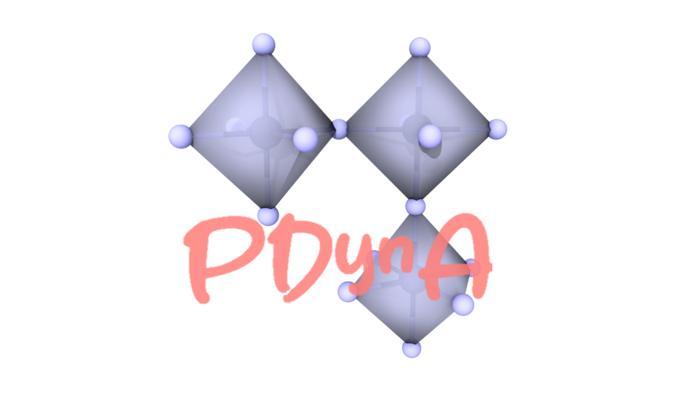
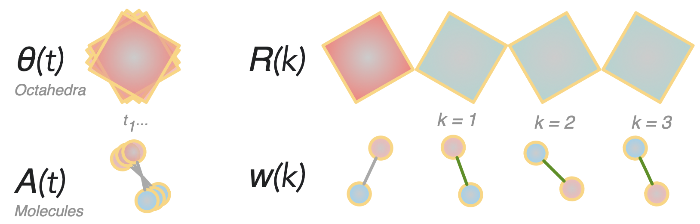
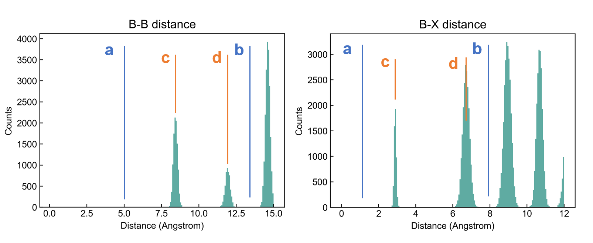

<!---  [](https://doi.org/10.5281/zenodo.5553202) --->
[](https://www.python.org/)
[](https://opensource.org/licenses/MIT)
[](https://pdyna.readthedocs.io/en/latest/)
[](https://zenodo.org/badge/latestdoi/568782890)



**P**erovskite **Dyn**amics **A**nalysis (**PDynA**) is a Python package for analysis of perovskite structural dynamics. 

The Python documentation of **PDynA** can be found at https://pdyna.readthedocs.io/en/latest/. 

Code features
--------
- The input to the code is molecular dynamics (MD) trajectories, currently readable formats are VASP-XDATCAR, XYZ, PDB (proteindatabank), ASE-Trajectory and LAMMPS dump files. The core class of PDynA is the `Trajectory` class.

- The structure recognition functions will automatically detect the constituent octahedral network and organic A-site molecules, and process the analysis. 

- The output is a selected set of the following properties: (pseudo-cubic) lattice parameter, octahedral distortion and tilting, time-averaged structure, A-site molecular orientation, A-site spatial displacement, radial distribution functions.

- The octahedral distortion and tilting calculation is the core feature of this package, which can quantitatively examine the dynamic behaviour of perovskite in terms of how octahedra tilt and distort, as well as the spatial correlation of these properties (Glazer notation). 

- The octahedral distortion and tilting calculation can be accelerated with parallelization by joblib, this can be tuned with the input parameter `multi_thread`. 

<p align="center">

</p>
 
List of modules
-------

* **pdyna** library containing:
  * **core.py**: Contains the dataclass Trajectory and Frame as well as their related functions. 
  * **structural.py**: Handles structure recognition and property calculations. 
  * **analysis.py**: A collection of tools for computing and visualizing the output.
  * **io.py**: The IO to input data files.


Requirements
------------

The main language is Python 3 and has been tested using Python 3.8+, with the following dependencies:
- Numpy
- Matplotlib
- Pymatgen
- Scipy
- ASE

Installation
------------

**PDynA** can be installed with the following commands:

Clone the repository (or download manually)

    git clone https://github.com/WMD-group/PDynA.git

cd to PDynA directory with the `setup.py` file
    
    cd pdyna
    
Install the package with pip

    pip install .

Pre-definition of the structure
------------

To start using the code, the user must define the B and X site elements in the BX6 octahedra. This can be done by defining the B and X sites species and their relative distances with the additional entry `system_overwrite` in the `dynamics`, for example, 
    
    traj.dynamics(..., system_overwrite=user_system)`

The input `user_system` is a dict with four entries: 

    {'B-sites': ['Sn'], 'X-sites': ['I','Br'], 'fpg_val_BB': [[a,b], [c,d]], 'fpg_val_BX': [[a,b], [c,d]]} 

The four numbers in B-B (`fpg_val_BB`) and B-X (`fpg_val_BX`) connectivity are: 

    c: NN1 distance of the connected pair
    d: NN2 distance of the connected pair
    a: lower bound of a range of distance that covers both and only NN1 and NN2
    b: upper bound of a range of distance that covers both and only NN1 and NN2

If you are not sure about the relative distances in your system, you can run the `system_test` function with one of your trajectories by calling: 

    traj = Trajectory(filetype,(file_path, MDtup))
    traj.system_test(B_sites=['Sn'],X_sites=['I','Br']) # with Sn(I/Br) system as an example

This will give you two plots as follows:

<p align="center">

</p>

An alternative way is to directly define the same quantities at the beginning of the `Trajectory` class if you are working with only one system throughout. 
    
    _Xsite_species = ['Cl','Br','I'] 
    _Bsite_species = ['Pb'] 
    _fpg_val_BB = [[5,13.5], [8.2,12]] # the values for above plot
    _fpg_val_BX = [[1,8], [3,6.8]] # the values for above plot


Usage
------------

Two molecular dynamics trajectories are given in the `examples` folder.

We encourage users to run orthogonal (the vectors connecting adjacent B-atoms are parallel to the principal axes) perovskite structures with corner-sharing connectivity to get the best performance of structure matching, when possible. 

**1. VASP-XDATCAR trajectory**

The minimal example is based on a VASP-XDATCAR format trajectory, containing about 100 atoms. 

Copy all the files under `examples/minimal` to your working directory and run the script `pdyna_example.py`. 


**2. LAMMPS trajectory**

The second example is a larger LAMMPS trajectory (about 20,000 atoms), covering more functions in **PDynA**. 

Copy all the files under `examples/lammps` to your working directory, unzip `lammps_example_mapbbr3.out.gz` and run the script `example_lammps.py`. 

For your own LAMMPS trajectory, please use a custom dump style with this command: `dump dump_name all custom dump_frequency ./dump.out id element x y z`


**3. XYZ/PDB/ASE trajectory**

Reading of these file types can be done similarly by running `traj = Trajectory(filetype,(file_path, MDtup))`, where `filetype` is one of "xyz", "pdb" or "ase-traj", the MD settings `MDtup = (Ti, Tf, timestep, nblock)` (`timestep` is MD time step in femtosecond, `nblock` is the frequency of frame saving).  


**4. Parameters explained**

A full list of all the parameters is shown in the `examples/full.py`. 


Computed Properties
------------

The computed dynamic properties are all stored in the Trajectory object and can all be accessed easily by calling `traj.Tilting`, `traj.Tilting_Corr`, `traj.Distortion`, etc, which are octahedral tilting, octahedral tilting NN1 correlations (effective Glazor notation), octahedral distortions, respectively. The dimension of these arrays are (N_frames,N_octahedra,property_dimension). 


Citation
------------
["Structural dynamics descriptors for metal halide perovskites" Journal of Physical Chemistry C (2023)](https://pubs.acs.org/doi/full/10.1021/acs.jpcc.3c03377)

```
@article{pdyna,
  title={Structural dynamics descriptors for metal halide perovskites},
  author={Liang, Xia and Klarbring, Johan and Baldwin, William J and Li, Zhenzhu and Cs{\'a}nyi, G{\'a}bor and Walsh, Aron},
  journal={J. Phys. Chem. C},
  volume={127},
  number={38},
  pages={19141--19151},
  year={2023}
}
```

Used in
------------
["Phase transitions, dielectric response, and nonlinear optical properties of aziridinium lead halide perovskites" Chemistry of Materials (2023)](https://pubs.acs.org/doi/10.1021/acs.chemmater.3c02200)

License and attribution
-----------------------

Python code and original data tables are licensed under the MIT License.


Development notes
-----------------

### Bugs, features and questions
Please use the [Issue Tracker](https://github.com/WMD-group/PDynA/issues) to report bugs or request features in the first instance. For other queries about any aspect of the code, please contact Xia Liang by e-mail: xia.liang16[at]imperial.ac.uk. 

### Lead developer
- Xia Liang (Department of Materials, Imperial College London)
